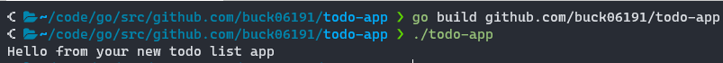
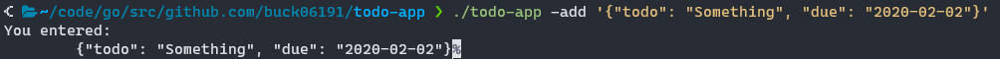

# Learning Go by making a Todo List app

Hello and welcome to my journey on becoming a Golang developer. I'll be doing this by creating the now-overused Todo List app. To try and learn as much about Go in the process, I want to handle as much of the logic in Go as possible, including parsing the form request from the web page.

To make this happen I'll be using the resources listed below, as well as lots of googling.

- [Go Docs](https://golang.org/doc/)
- [Go in Practice](https://livebook.manning.com/book/go-in-practice/)
- [Go by Example](https://gobyexample.com/)

Let's start though by defining what we want from our Todo List app by defining a number of user stories.

## User Stories

As a user I want:

- To add items to and remove items from my todo list using a web interface and form.
- To add items for either myself or a team I belong to. There will be multiples of either.
- For my personal items to be hidden from the team I belong to.
- For my todo list to persist between sessions.
- To be able to set an optional due date for an item.

## Using Go

We'll start by making a file to put all of the code in

```bash
touch main.go
```

and then add in a few basic requirements for starting out.

```go
package main

import (
  "fmt"
)

func main() {
  fmt.Println("Hello from your new todo list app")
}
```

We then build the program using

```bash
go build github.com/buck06191/todo-app
```

before running the binary that this creates:



## Reading from the command line

Let's get started on the Todo List app by starting as simple as possible. I'll begin by making a CLI for the ToDo list in Go. Ideally a lot of the logic used to make the CLI work will transfer over to handling requests from the web page interface that will come later. The command line needs to accept a JSON string of the form

```json
{
  "task": "todo task",
  "due": "optional due date (yyyy-mm-dd)"
}
```

This should then be given a unique ID by Golang or the database. For example,

```json
{
  "id": 1,
  "task": "Practice Go",
  "due": "2020-02-02"
}
```

Let's start by reading that in and echoing it back to the user on the CLI.

We begin by using the `flag` package to set up command line flags and read in values.

We then need to make a function to read this value and print it back out to the terminal. The `flag.String` function gives us an address to the value, meaning we'll need to access it as a pointer.

Finally we add in a `main()` function that parses the arguments using `flag.Parse()` and then echoes back the item.

```go
// Package todo contains a basic CLI todo app
package todo

import (
  "flag"
  "fmt"
)

var todoItem = flag.String("add", "Something worth doing", "Item to add to todo list.\n\t{\"todo\": task to do, \"due\": date due (YYYY-MM-DD)}")


// EchoItem echoes back the command line input.
func PrettyPrintItem(item *string) {
  fmt.Printf("You entered:\n\t%s", *todoItem)
}

func main() {
  flag.Parse()

  PrettyPrintItem(todoItem)
}
```

This should give the following:


However, we need to make sure that we parse the command line input to check for anything that doesn't fit our desired JSON structure. We need to deserialise our JSON into a `struct` and then parse it in order to convert it into a usable format.

First, we need to define our `TodoItem` type which we can then parse as required.

```go
import (
  ...
  "encoding/json"
)

// TodoItem is the internal type used to store the JSON data that is
// deserialised by the app.
type TodoItem struct {
  Todo string `json:"todo"`
  Due  string `json:"due,omitempty"`
}
```

Here we have used struct tags to define the json field names, as well as allowing for an empty `Due` field. Next we need to define a type for our `ParsedTodoItem` where we convert the `Due` field to use the `time.Time` type.

```go
// ParsedTodoItem is the same as the TodoItem type, albeit with the `Due` field
// parsed to due the `time.Time` struct.
type ParsedTodoItem struct {
  Todo string
  Due  time.Time
}
```

We then parse our command line input with the end goal of producing a `ParsedTodoItem`. First, we deserialise the string from the command line using `json.Unmarshal`, giving us a `TodoItem`. Next we take the `Due` field of this deserialised JSON and parse it to a `time.Time` using the `parseDueDate` function.

If the field is empty, we return a zero-value for the `time.Time` type. Otherwise, we then check if we can parse it from our correct format. Go uses a particular way of defining a datetime string format, as described in the [`time.format` docs](https://golang.org/pkg/time/#Time.Format). If the format is incorrect, we tell the user and exit the program. Moving forwards we'll want to handle this more gracefully, but for now (when only handling single tasks from the command line), this works fine. If the passed date can be parsed, it is returned from the function.

Finally, we build our `ParsedTodoItem` from our original `Todo` and our new `parsedDueDate` and return that from this function. I've purposefully chosen to build a new variable here as I'm trying to avoid side effects that could potentially come from mutating the value in place.

```go
func parseDuedate(dueDate string) (parseddueDate time.Time) {
  if dueDate == "" {
    return time.Time{}
  }

  const dueDataFormat = "2006-01-02"

  parsedDueDate, parseErr := time.Parse(dueDataFormat, dueDate)

  if parseErr != nil {
    log.Fatal("Badly formed due date.")
  }

  return parsedDueDate
}

// ParseInput parses the input into something more usable.
// This includes checking for empty input and parsing the
// `due` field.
func ParseInput(input *string) ParsedTodoItem {
  var todoItem TodoItem

  err := json.Unmarshal([]byte(*input), &todoItem)
  if err != nil {
    log.Fatal("Invalid JSON passed to ./todo-app")
  }

  parsedDueDate := parseDuedate(todoItem.Due)

  parsedItem := ParsedTodoItem{Todo: todoItem.Todo, Due: parsedDueDate}

  return parsedItem

}
```

We now need to modify our `PrettyPrintItem` function to take this new type. First we convert the `struct` back to a JSON string, and we use `json.MarshalIndent` to format the output into something slightly easier to read.

```go
// PrettyPrintItem echoes back the parsed command line input.
func PrettyPrintItem(item ParsedTodoItem) (n int, err error) {
  formattedItem, err := json.MarshalIndent(item, "\t", "\t")
  if err != nil {
    return 0, err
  }
  return fmt.Printf("You entered:\n\n\t%s", string(formattedItem))
}
```

Compiling and running this final code with a number of example JSON strings gives us the following:


In the next part we'll look at introducing testing into the codebase so that we don't need to continually run against command line examples in order to check that the code is working. (Ideally I'd have done this from the start and followed test-driven development ideals.)
